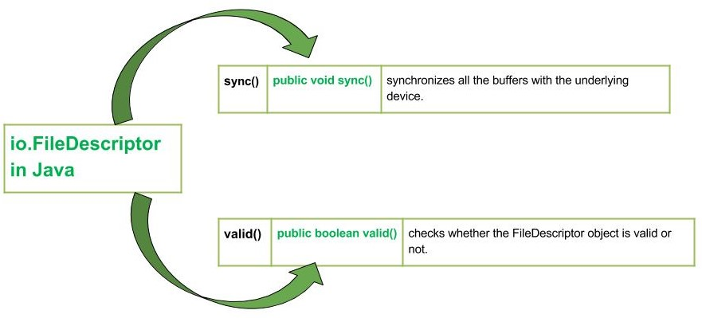

# Java FileDescriptor Class

- java.io.FileDescriptor class in Java works for opening a file having a specific name.
- If there is any content present in that file it will first erase all that content and put “Beginning of Process” as the first line.
- Instances of the file descriptor class serve as an opaque handle to the underlying machine-specific structure representing an open file, an open socket, or another source or sink of bytes.

* The main practical use for a file descriptor is to create a FileInputStream or FileOutputStream to contain it.

* Applications should not create their own file descriptors.

**There are 3 major fields in this class:**

- err: A handle to the standard error stream.
- in: A handle to the standard input stream.
- out: A handle to the standard output stream.

### Declaration of FileDescriptor

<code>
public final class FileDescriptor
   extends Object
</code>

- Constructor – FileDescriptor(): constructs a FileDescriptor object

## Methods Associated with FileDescriptor in Java

There are two main methods as mentioned below:

- java.io.File.sync(): synchronizes all the buffers with the underlying device.
- java.io.File.valid(): checks whether the FileDescriptor object is valid or not.

1. sync() Method
   java.io.File.sync() synchronizes all the buffers with the underlying device. When all the modified data of the FileDescriptor have been written to the underlying device, the method returns.

Syntax :

public void sync()

Return : void

Exception: SyncFailedException – This is exception is thrown if there is no guarantee of synchronization of buffers with the device.
