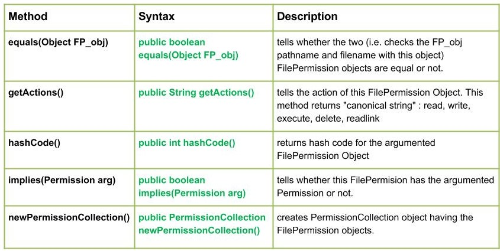

# FilePermissionClass

- java.io.FilePermission class represents access to a file or directory. These accesses are in the form of a path name and a set of actions associated with the path name(specifies which file to open along with the extension and the path).

- Example: In FilePermission(“GEEKS.txt”, “read”) “GEEKS.txt” is the path, and “read” is the action being performed.

### Supported Actions:

- read: Grants permission to read the file.
- write: Grants permission to write to the file.
- delete: Grants permission to delete the file by calling File.delete
- readlink: Grants permission to read symbolic links.
- execute: Grants permission to execute the file.

<pre>
  //Class Declaration of FilePermission Class

  public final class FilePermission
  extends Permission
  implements Serializable
  </pre>

## Constructor of FilePermission Class

FilePermission(String p, String a): Creates a new file permission object with “a” action.

### Methods of FilePermission Class

