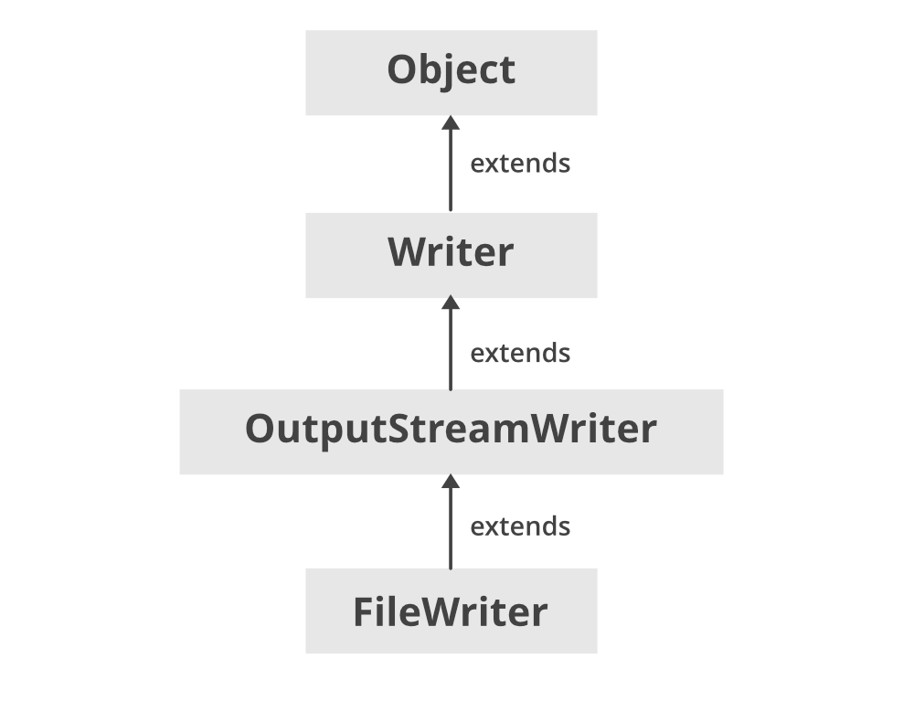

# FileWriterClass

<pre> ```java FileWriter writer = new FileWriter("output.txt"); writer.write("Hello"); writer.close(); ``` </pre>

- FileWriter Class inherits OutputStreamWriter class inherits Writer class.

- By default, it uses:
  a) The platform's default character encoding.
  b) The default byte-buffer size.

- If you want to specify a different encoding or buffer size, use an OutputStreamWriter wrapped around a FileOutputStream.

- FileWriter will create the file if it doesn't exist.

- If you need to write raw bytes (not characters), use FileOutputStream instead.

### Basic usage of FileWriter

<pre>
FileWriter writer = new FileWriter("output.txt");
writer.write("Hello, world!");
writer.close();
</pre>

### Using OutputStreamWriter for custom encoding:

<pre>
OutputStreamWriter writer = new OutputStreamWriter(
new FileOutputStream("output.txt"), "UTF-8");
writer.write("Hello, world!");
writer.close();
</pre>



## Appending Data to a File

<pre>
// Appending Data to a File
import java.io.*;

class AppendingFile 
{
    public static void main (String[] args) 
    {
      	// Appending Data in the File
       	try (FileWriter writer = new FileWriter(fileName, true)) { 
          	
          	// true for append mode
          	writer.write("\nAppending this line to the file.");
          	System.out.println("Data appended to the file successfully.");
		} 
      	catch (IOException e) {
    		System.out.println("An error occurred while appending"
                               + " to the file: " + e.getMessage());
		}
    }
}

</pre>

### Overwriting vs Appending the File

<span style="color:yellow">Tip or Note</span>

- Overwriting a File: While creating a Java FileWriter, we can decide whether we want to append the file to an existing file, or we want to overwrite any existing file.
- This can be decided by choosing the appropriate constructor.
- The constructor for overwriting any existing file takes only one parameter that is a file name.

<code>
Writer fileWriter = new FileWriter(“C:\\FileHandling\\FileDescriptor\\FILE.txt”); </code>

### Appending to a File:

- The constructor for appending the file or overwriting the file, takes two parameters, the file name and a boolean variable which decides whether to append or overwrite the file

<code>
 Writer fileWriter = new FileWriter(“C:\\FileHandling\\FileDescriptor\\FILE.txt”, true); // appends to file
Writer fileWriter = new FileWriter(C:\\FileHandling\\FileDescriptor\\FILE.txt”, false); // overwrites file 
</code>

### FileWriter vs FileOutputStream

<span style="color:yellow">Tip or Note</span>
FileWriter writes streams of characters while FileOutputStream is meant for writing streams of raw bytes.
FileWriter deals with the character of 16 bits while on the other hand, FileOutputStream deals with 8-bit bytes.
FileWriter handles Unicode strings while FileOutputStream writes bytes to a file and it does not accept characters or strings and therefore for accepting strings, it needs to be wrapped up with OutputStreamWriter. string
