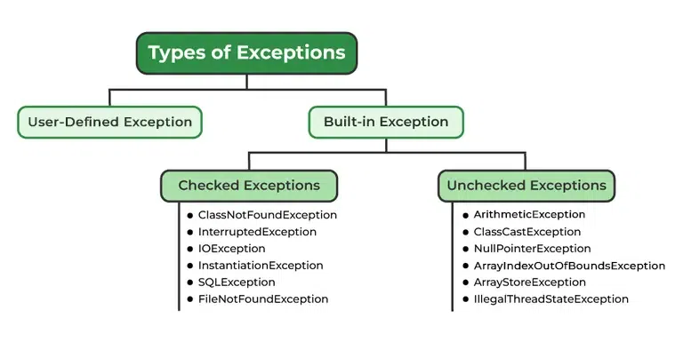

# errors

Errors represent irrecoverable conditions such as Java virtual machine (JVM) running out of memory, memory leaks, stack overflow errors, library incompatibility, infinite recursion, etc. Errors are usually beyond the control of the programmer, and we should not try to handle errors.
Examples :
OutOfMemoryError
StackOverFlowError

# exception handling

Exception indicates conditions that a reasonable application might try to catch

Caused by conditions in the program such as invalid input or logic errors.

Types of Java Exceptions

1. Built-in Exception
   Build-in Exception are pre-defined exception classes provided by Java to handle common errors during program execution.

   1.1 ) Checked Exceptions
   Checked exceptions are called compile-time exceptions because these exceptions are checked at compile-time by the compiler.

   for ex : such as
   ClassNotFoundException: Throws when the program tries to load a class at runtime but the class is not found because it’sbelong not present in the correct location or it is missing from the project.

   1.2 ) Unchecked Exceptions
   The unchecked exceptions are just opposite to the checked exceptions. The compiler will not check these exceptions at compile time. In simple words, if a program throws an unchecked exception, and even if we didn’t handle or declare it, the program would not give a compilation error.

   for ex: ArithmeticException: It is thrown when there’s an illegal math operation.
   ClassCastException: It is thrown when you try to cast an object to a class it does not belongThis to. so on...

2. User-Defined Exception
   Sometimes, the built-in exceptions in Java are not able to describe a certain situation. In such cases, users can also create exceptions, which are called “user-defined Exceptions“.

🔸 How Does JVM Handle an Exception?
When an exception happens, the Java Virtual Machine (JVM) creates an exception object. This object holds:

- The error name
- A description of the error
- The state of the program at the time

Creating this object and dealing with it at runtime is called throwing an exception.

Java also keeps track of which methods were called before the error. This list is called the call stack.

Then the following steps happen:

- The runtime system looks through the call stack to find an exception handler.

- It starts from the method where the error happened and checks each method backwards.

- If it finds a handler, it sends the exception to that handler.

- If no handler is found, the JVM uses the default handler, which:

) Stops the program

) Prints the stack trace (the call stack and the error)

🔸 How Does a Programmer Handle an Exception?
Java provides a way to handle exceptions using five keywords:

try — Block where code that might throw an exception is written.

catch — Catches and handles the exception.

throw — Used to manually throw an exception.

throws — Declares that a method might throw exceptions.

finally — Code here always runs after try, with or without an exception.

This is called customized exception handling, and it lets you control what happens when something goes wrong.

=================================================================================================

🔹 throw
Used to manually throw an exception.

Written inside a method or block.

Can only throw one exception at a time.

Follows the syntax:
throw new ExceptionType("message");

Works during runtime (execution).

Must be followed by an exception object (like new ArithmeticException()).

🔹 throws
Used to declare that a method might throw an exception.

Written in the method signature.

Can declare multiple exceptions, separated by commas.

Follows the syntax:
returnType methodName() throws ExceptionType

Works during compile time to warn the caller.

Used with checked exceptions, mostly.

// Using throw
void test() {
throw new ArithmeticException("Error!"); // throws an exception manually
}

// Using throws
void test() throws ArithmeticException {
int x = 1 / 0; // may throw exception, so declared
}
